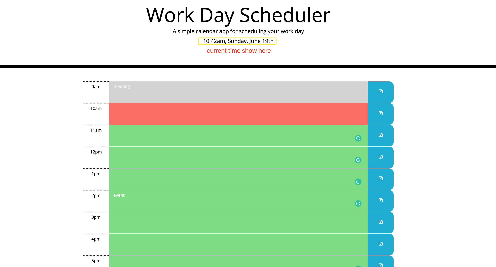

## Work Day Scheduler

* Create a simple calendar application that allows a user to save events for each hour of the day by modifying starter code. This app will run in the browser and feature dynamically updated HTML and CSS powered by jQuery.

## Acceptance Criteria

* when user opens the planner, the current day is displayed at the top of the calendar
  
* when user scrolls down, will be presented with timeblocks for standard business hours, each timeblock is color coded to indicate whether it is in the past, present, or future
  
* user can enter an event to the timeblocks
  
* when user clicks the save button for that timeblock, the text for that event is saved in local storage
  
* if user refreshs the page, the saved events persist

## Deployed Repository 
https://dorisliu333.github.io/work-day-scheduler-chujunliu/
